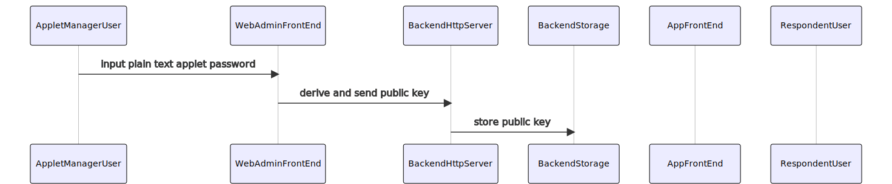
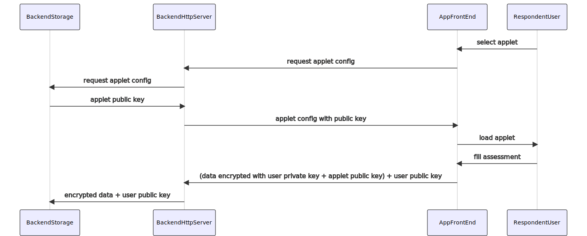

MindLogger Node Client

## Installation

```
npm i mindlogger-node
```

## Local development

- Fork / clone
- Run `npm install`
- Create `config.test.json` similar to `config.test.sample.json`:

```json
{
  "username": "____________",
  "password": "____________",
  "applets": [
    {
      "appletId": "____________",
      "appletPassword": "____________"
    }
  ]
}
```

- Run `npm test`

## Usage

### CLI

```
Commands:
  cli.js authentication       Get authentication results
  cli.js applet-info          Get applet info
  cli.js applet-data          Get applet data
  cli.js decrypt-applet-data  Decrypt applet data

Options:
      --version  Show version number                                   [boolean]
  -o, --outFile  Optional output file                                   [string]
      --help     Show help                                             [boolean]
```

### Library

#### Client

```ts
import { Client } from "mindlgoger-node";

const client = await Client.createClient("<username>", "<password>");

const appletInfo = await client.getAppletInfo("<appletId>");
const appletData = await client.getAppletData("<appletId>");
const responses = decryptAppletResponses(
  appletInfo,
  appletData,
  "<appletPassword>"
);
```

See [the generated docs](docs).

## Data flow

### Applet creation



### Applet response


